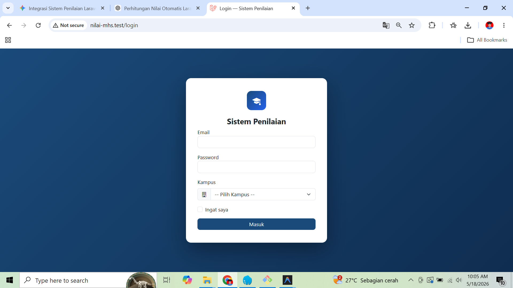
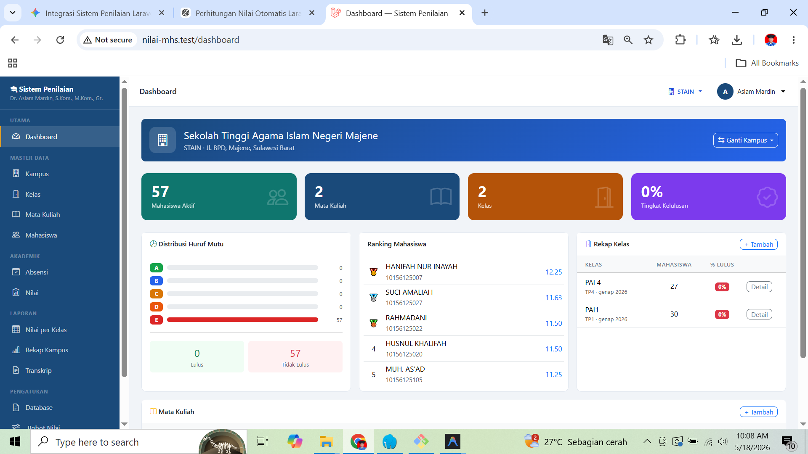
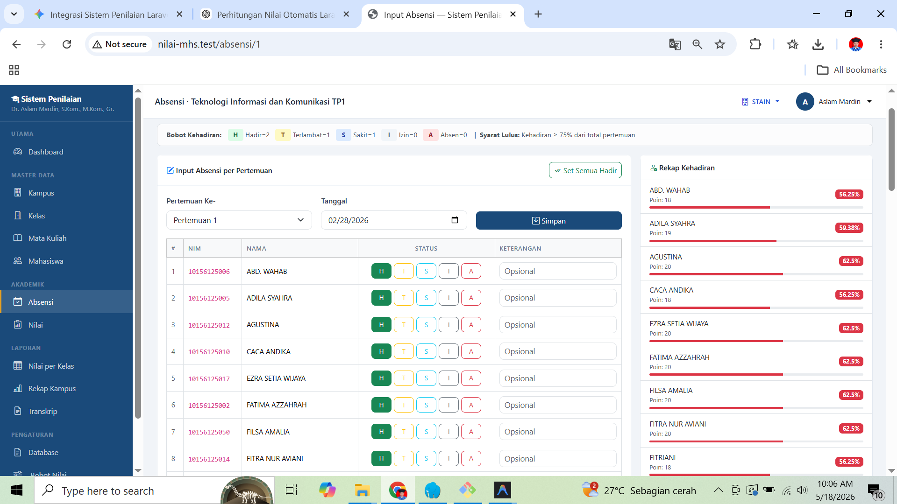
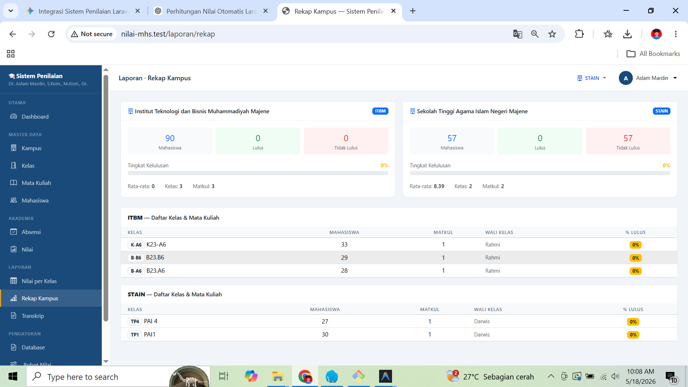

# 🎓 Nilai-Mhs: Sistem Penilaian & Akademik Terpadu

Aplikasi berbasis **Laravel** untuk mengelola data akademik secara komprehensif, mulai dari data mahasiswa, absensi harian, hingga kalkulasi otomatis nilai akhir dan pencetakan laporan.

---

## 🚀 Sekilas Aplikasi
**Nilai-Mhs** dirancang untuk memudahkan dosen dan pengelola kampus dalam:
- Mengelola data master (Kampus, Kelas, Mata Kuliah, Mahasiswa).
- Menginput absensi harian secara efisien dengan riwayat per pertemuan.
- Menghitung nilai secara transparan dengan rincian komponen Keaktifan (via *Checklist*), Tugas (Dinamis), UTS, dan UAS.
- Mengelola penilaian praktikum secara terpisah.
- Mengekspor data dalam format PDF dan Excel.

---

## 📸 Tampilan Aplikasi (Screenshots)

Berikut adalah beberapa pratinjau antarmuka aplikasi:

### 1. Halaman Login

*Halaman autentikasi sistem.*

### 2. Dashboard Utama

*Gambaran statistik kampus, jumlah mahasiswa, dan tingkat kelulusan.*

### 3. Manajemen Master Data

*Halaman manajemen kelas perkuliahan.*


*Halaman manajemen daftar mahasiswa per kampus.*

### 4. Form Input Absensi Harian

*Tampilan form absensi per pertemuan.*

### 5. Modul Penilaian

*Form Keaktifan dengan sistem Checklist interaktif.*


*Penambahan dan pengisian kolom tugas secara dinamis.*


*Form untuk menginput nilai ujian (UTS/UAS).*

### 6. Rekapitulasi & Laporan

*Tabel rekapitulasi nilai akhir mahasiswa dan kehadiran.*


*Statistik nilai dan distribusi huruf mutu suatu mata kuliah.*


*Halaman laporan rekap keseluruhan.*


*Hasil ekspor dokumen ke format PDF.*

### 7. Pengaturan Sistem

*Halaman untuk mengatur persentase bobot tiap komponen nilai.*


*Fitur backup dan pemulihan database sistem.*


*Monitoring penggunaan resource server.*

### 8. Pengaturan Akun

*Halaman pengaturan data profil pengguna.*


*Halaman pergantian kata sandi yang aman.*

---

## 🔄 Alur Kerja (Workflow) Sistem

1. **Pengaturan Master Data (Admin/Kaprodi):**
   - Menambahkan data **Kampus** dan **Kelas**.
   - Menambahkan data **Mata Kuliah** beserta detail bobot (Teori/Praktikum) dan jumlah pertemuannya.
   - Memasukkan data **Mahasiswa** ke dalam kelas.

2. **Manajemen Kelas (KRS/Pendaftaran):**
   - Mendaftarkan mahasiswa ke mata kuliah tertentu agar mereka masuk ke dalam daftar absensi dan penilaian.

3. **Operasional Harian (Dosen):**
   - **Absensi:** Dosen masuk ke menu Absensi, memilih pertemuan, dan mencatat status kehadiran mahasiswa. Keterangan spesifik (Sakit, Izin) dapat dicantumkan.
   - **Keaktifan:** Dosen masuk ke form Keaktifan, lalu mengklik sel mahasiswa untuk mencentang indikator keaktifan. Sistem mencegah skor melebihi batas maksimal (100).
   - **Tugas:** Dosen bebas menambahkan kolom-kolom tugas spesifik dan mengisi skornya. Sistem otomatis membagi rata-ratanya.

4. **Ujian & Penilaian Akhir (Akhir Semester):**
   - Dosen menginput nilai akhir UTS dan UAS di form **Input Teori**.
   - Sistem secara cerdas menggabungkan semua nilai berdasarkan bobot yang ditetapkan pada master data (misal: Keaktifan 20%, Tugas 20%, UTS 25%, UAS 35%).
   - Sistem memeriksa syarat kehadiran minimal (standar ≥ 75%). Jika di bawah itu, mahasiswa otomatis dinyatakan **Tidak Lulus** secara sistem.

5. **Pelaporan (Laporan & Cetak):**
   - Angka desimal nilai akhir terkonversi secara otomatis ke Huruf Mutu (A, B, C, D, E).
   - Pengelola mencetak Laporan Rekap Nilai Mata Kuliah atau mendistribusikan berkas dalam wujud Excel (XLSX) maupun PDF.

---

## ⚙️ Syarat Sistem & Instalasi

### Prasyarat
- PHP >= 8.2
- Composer
- MySQL / MariaDB
- Node.js & NPM (Opsional, untuk aset Vite)

### Langkah-langkah Instalasi

1. **Kloning Repositori**
   ```bash
   git clone https://github.com/username/nilai-mhs.git
   cd nilai-mhs
   ```

2. **Instalasi Dependensi**
   ```bash
   composer install
   npm install && npm run build
   ```

3. **Konfigurasi Lingkungan (Environment)**
   Salin file konfigurasi bawaan dan sesuaikan kredensial database Anda:
   ```bash
   cp .env.example .env
   php artisan key:generate
   ```
   *Buka file `.env` lalu sesuaikan `DB_DATABASE`, `DB_USERNAME`, dan `DB_PASSWORD` Anda.*

4. **Migrasi Database & Seeding**
   Siapkan struktur tabel dan data *dummy* awal dengan menjalankan perintah berikut:
   ```bash
   php artisan migrate:fresh --seed
   ```

5. **Jalankan Aplikasi**
   ```bash
   php artisan serve
   ```
   Aplikasi dapat diakses di: `http://localhost:8000`

### Akun Login Default
- **Email:** `aslam11mardin@gmail.com`
- **Password:** `password`

*(Catatan: Sesuaikan kembali email ini jika Anda memodifikasi file DatabaseSeeder)*

---

## 🛠 Teknologi yang Digunakan
- **Backend:** Laravel 11+, PHP 8.2+
- **Frontend:** Blade Templating, Bootstrap 5, Vanilla JavaScript
- **Database:** MySQL
- **Library Ekspor:**
  - `barryvdh/laravel-dompdf` (PDF)
  - `maatwebsite/excel` (Excel)
